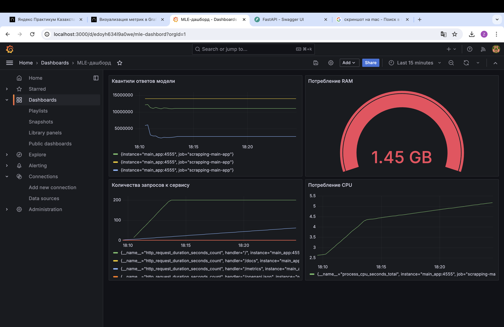

# Мониторинг

## Для мониторинга выбраны метрики нескольких метрик:

Квантили ответов модели - для мониторинга распределния ответов модели

Количества запросов к сервису - для наблюдения за нагрузкой на сервис

Потребление RAM и Потребление CPU - для наблюдения ресурсов сервера

